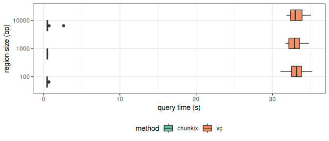

``` r
library(dplyr)
```

    ## 
    ## Attaching package: 'dplyr'

    ## The following objects are masked from 'package:stats':
    ## 
    ##     filter, lag

    ## The following objects are masked from 'package:base':
    ## 
    ##     intersect, setdiff, setequal, union

``` r
library(ggplot2)
library(tidyr)
library(knitr)
```

## Read benchmarking files

``` r
nregs = 50
reg_size = c(100, 1000, 10000)

df = lapply(reg_size, function(rs){
  read.table(paste0('benchmark.query.', nregs, '.', rs, '.tsv'), header=TRUE, sep='\t', comment='') %>%
    mutate(size=rs)
}) %>% bind_rows

sample_n(df, 3) %>% select(size, method, region, s)
```

    ##    size  method                             region         s
    ## 1  1000 chunkix  GRCh38#0#chr3:183205528-183206528  0.510947
    ## 2 10000      vg GRCh38#0#chr12:110243679-110253679 31.904539
    ## 3   100 chunkix  GRCh38#0#chrX:104749826-104749926  0.443835

## Query time distribution

``` r
ggplot(df, aes(x=factor(size), y=s, fill=method)) +
  geom_boxplot(position='dodge') + theme_bw() +
  xlab('region size (bp)') + coord_flip() +
  scale_fill_brewer(palette='Set2') +
  theme(legend.position='bottom') + 
  ylab('query time (s)')
```

<!-- -->

## Summary table

Average query time per method and region size.

``` r
df %>% group_by(method, size) %>%
  summarize(s=mean(s, na.rm=TRUE), .groups='drop') %>%
  pivot_wider(names_from=method, values_from=s) %>%
  kable
```

|  size |   chunkix |       vg |
|------:|----------:|---------:|
|   100 | 0.4678588 | 33.15725 |
|  1000 | 0.4947729 | 32.98116 |
| 10000 | 0.5460327 | 33.14395 |
