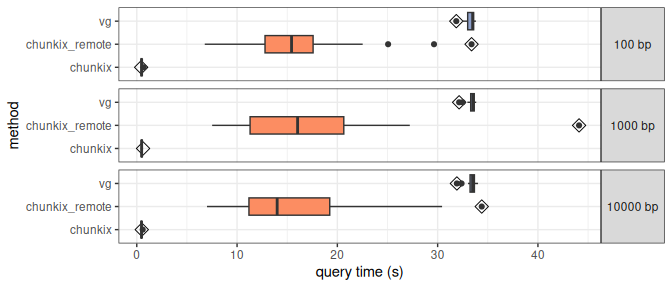

``` r
library(dplyr)
```

    ## 
    ## Attaching package: 'dplyr'

    ## The following objects are masked from 'package:stats':
    ## 
    ##     filter, lag

    ## The following objects are masked from 'package:base':
    ## 
    ##     intersect, setdiff, setequal, union

``` r
library(ggplot2)
library(tidyr)
library(knitr)
```

## Read benchmarking files

``` r
nregs = 20
reg_size = c(100, 1000, 10000)

df = lapply(reg_size, function(rs){
  read.table(paste0('benchmark.query.', nregs, '.', rs, '.tsv'), header=TRUE, sep='\t', comment='') %>%
    mutate(size=rs)
}) %>% bind_rows

sample_n(df, 3) %>% select(size, method, region, s)
```

    ##    size         method                           region         s
    ## 1 10000 chunkix_remote  GRCh38#0#chrY:29396765-29406765  7.003057
    ## 2   100             vg GRCh38#0#chr18:79276077-79276177 33.524945
    ## 3  1000 chunkix_remote    GRCh38#0#chrX:9217121-9218121  9.896849

Annotate the query number to check if the first query takes longer for
remote files (because of the time it takes to download the tbi files).

``` r
df = df %>% group_by(size) %>%
  mutate(query.nb=as.numeric(factor(region, levels=unique(region))),
         size.label=paste(size, 'bp'))
```

## Query time distribution

``` r
ggplot(df, aes(x=method, y=s, fill=method)) +
  geom_point(data=subset(df, query.nb==1), size=3, alpha=1,
             position=position_dodge(.75), shape=5) + 
  geom_boxplot(position='dodge') + theme_bw() +
  coord_flip() +
  scale_fill_brewer(palette='Set2') +
  guides(fill='none') + 
  facet_grid(size.label~.) + 
  ylab('query time (s)') +
  theme(strip.text.y=element_text(angle=0))
```

<!-- -->

The diamond highlights the first query. When querying remote files, the
first query takes more time because the tbi files need to be downloaded.

``` r
df %>% filter(method=='chunkix_remote') %>%
  group_by(size) %>% summarize(med.s=median(s), first.s=s[query.nb==1]) %>%
  mutate(first.penalty.s=first.s-med.s) %>% kable
```

|  size |    med.s |  first.s | first.penalty.s |
|------:|---------:|---------:|----------------:|
|   100 | 15.43305 | 33.38279 |        17.94973 |
|  1000 | 16.03757 | 44.10231 |        28.06474 |
| 10000 | 13.99856 | 34.39622 |        20.39767 |

Downloading the tbi files adds about 20 seconds in our case

Note: this remote query was performed from France and accessing index
files hosted in a server in Santa Cruz, California.

## Summary table

Average query time per method and region size.

``` r
df %>% group_by(method, size) %>%
  summarize(s=mean(s, na.rm=TRUE), .groups='drop') %>%
  pivot_wider(names_from=method, values_from=s) %>%
  kable
```

|  size |   chunkix | chunkix_remote |       vg |
|------:|----------:|---------------:|---------:|
|   100 | 0.4868282 |       16.24498 | 33.26382 |
|  1000 | 0.4965837 |       17.37299 | 33.37983 |
| 10000 | 0.4763262 |       15.90399 | 33.39566 |

## File size comparison

``` r
size.df = read.table('file.sizes.tsv', as.is=TRUE, sep='\t', header=TRUE)

size.plot.df = size.df %>% mutate(size.gib=size/(1024*1024*1024),
                                  type=ifelse(grepl('tabix', file), 'tabix', file),
                                  type=factor(type, rev(unique(type))),
                                  subfile=ifelse(grepl('tabix', file), gsub('tabix-', '', file), 'NA'))

ggplot(size.plot.df, aes(x=type, y=size.gib)) +
  geom_col() + 
  geom_col(aes(fill=subfile), data=subset(size.plot.df, type=='tabix')) + 
  coord_flip() + theme_bw() +
  ylab('file size (GiB)') +
  scale_fill_brewer(palette='Set2', name='tabix files') +
  theme(axis.title.y=element_blank(),
        legend.position='inside',
        legend.position.inside=c(.99, .01),
        legend.justification.inside=c(1,0))
```

<!-- -->

## Figure

``` r
p1 = ggplot(size.plot.df, aes(x=type, y=size.gib)) +
  geom_col() + 
  geom_col(aes(fill=subfile), data=subset(size.plot.df, type=='tabix')) + 
  coord_flip() + theme_bw() +
  ylab('file size (GiB)') +
  scale_fill_brewer(palette='Set2', name='tabix files') +
  theme(axis.title.y=element_blank(),
        legend.position='inside',
        legend.position.inside=c(.99, .01),
        legend.justification.inside=c(1,0))
p2 = ggplot(df, aes(x=method, y=s)) +
  geom_point(data=subset(df, query.nb==1), size=3, alpha=1,
             position=position_dodge(.75), shape=5) + 
  geom_boxplot(position='dodge', fill='grey90') + theme_bw() +
  coord_flip() +
  guides(fill='none') + 
  facet_grid(size.label~.) + 
  ylab('query time (s)') +
  theme(strip.text.y=element_text(angle=0))

pdf('pgchunking.fig.pdf', 10, 3)
gridExtra::grid.arrange(p1, p2, nrow=1)
dev.off()
```

    ## png 
    ##   2
