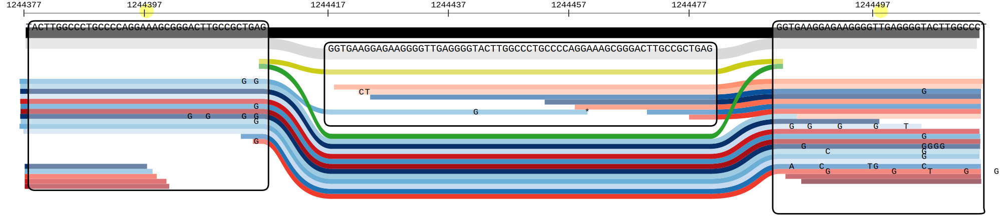
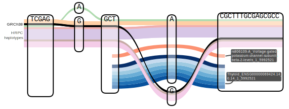
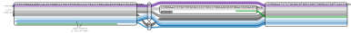

## Sequence Tube Map

We use [the *color* branch](https://github.com/vgteam/sequenceTubeMap/tree/color) of the Sequence Tube Map repository which contains a few tweaks useful in our case. 
In particular, the option to use a track's opacity to represent mapping quality or any integer score (e.g. read coverage).
We have also prepared a Docker container at `quay.io/jmonlong/sequencetubemap:vggafannot`.

The Sequence Tube Map server can be started with:

```sh
docker run  -it -m 6g -p 3210:3000 -v `pwd`:/data quay.io/jmonlong/sequencetubemap:vggafannot
```

Then visiting [http://localhost:3210/](http://localhost:3210/).

This assumes that the pangenome and annotations files are in the working directory (or in sub-directories).

### Aligned reads + genotype calls

Using: 

1. `hprc-v1.1-mc-grch38.gbz` as *graph*
1. `hprc-v1.1-mc-grch38.gbz` as *haplotype*
1. `HG002.gaf.gz` as *reads*. These are actual reads produced and described in [`../readsorting`](../readsorting).
2. `HG002.gt.min30bp.sorted.gaf.gz` as *reads*. These are genotype calls produced and described in [`../variants`](../variants).



### Known variants from the GWAS Catalog and GTEx's eQTLs

Using: 

1. `hprc-v1.1-mc-grch38.gbz` as *graph*
1. `hprc-v1.1-mc-grch38.gbz` as *haplotype*
2. `gwasCatalog.hprc-v1.1-mc-grch38.sorted.gaf.gz` as *reads*. These are variants from the GWAS Catalog projected into the pangenome, produced and described in [`../variants`](../variants).
2. `eQTLs.gaf.gz` as *reads*. These are expression QTLs from GTEx projected into the pangenome, produced and described in [`../variants`](../variants).



### HPRC gene and repeat annotations

Using: 

1. `hprc-v1.1-mc-grch38.gbz` as *graph*
1. `hprc-v1.1-mc-grch38.gbz` as *haplotype*
2. `gene_CDS.gaf.gz` as *reads*. These are coding sequences (CDS) produced and described in [`../annotate`](../annotate).



### ATAC-seq coverage from ENCODE

Using: 

1. `hprc-v1.1-mc-grch38.gbz` as *graph*
1. `hprc-v1.1-mc-grch38.gbz` as *haplotype*
2. Coverage track GAFs as *reads* produced and described in [`../encode`](../encode):
    - `breast_epithelium.cov.gaf.gz`
    - `gastrocnemius_medialis.cov.gaf.gz`
    - `gastroesophageal_sphincter.cov.gaf.gz`
    - `sigmoid_colon.cov.gaf.gz`
    - `spleen.cov.gaf.gz`
    - `thyroid_gland.cov.gaf.gz`
    - `PeyersPatch.cov.gaf.gz`
3. Switch on *Fully transparent nodes*
3. Switch on *Transparency of reads by mapping quality*
3. Eventually, switch on *Compressed view*


## Bandage-NG

A helper script is available at [`prep_bandage_subgraph.py`](prep_bandage_subgraph.py) to extract and prepare a subgraph and annotatiosn for visualization in Bandage-NG.
Briefly, it uses `vg chunk` to extract a subgraph and annotations (GAF files) for a specified region on the reference genome.
The subgraph is converted in a GFA file that Bandage will take (putting the *P* paths last). 
The GAF files are also merged, path names de-duplicated, and paths traversing missing nodes trimmed or filtered.

Inputs files are :

1. an input large graph in a VG format, e.g. `.gbz` or `.pg`
1. annotation files in bgzipped and indexed GAF. Optional

For example, the command to prepare the Alu insertion within the *PRAMEF4* coding sequence, I ran:

```sh
python3 prep_bandage_subgraph.py -p GRCh38#0#chr1:12881791-12882291 -g hprc-v1.1-mc-grch38.gbz -a rm.gaf.gz -a gene_CDS.gaf.gz
```

Here, *gene_CDS.gaf.gz* and *rm.gaf.gz* are annotation files produced and described in [`../annotate`](../annotate).
This command took about 17 seconds to make two files that can be opened in Bandage-NG: 

- `chunk.gfa` with the subgraph. Load with *File->Load graph*
- `chunk.gaf` with the annotations. Load with *File->Load path*

Once loaded:

1. *Draw graph* (left panel).
1. Look at the annotation path list by clicking on *Paths* (right panel).
1. Copy-paste a path name in the *Name:* field of the *Find paths* section (right panel).
   1. Click on *Find path* to select nodes on this path.
   1. Use *Set colour* to color those nodes.
2. Repeat with other annotations to highlight.


See the *usage* message for some help too:

```sh
usage: Prepare a subgraph and annotations for Bandage [-h] -g G [-a A] -p P [-c C] [-o O]

options:
  -h, --help  show this help message and exit
  -g G        pangenome in a VG format, e.g. .gbz or .pg
  -a A        optional annotations, in bgzipped and indexed GAF files. Can repeat
  -p P        path coordinates
  -c C        additional node context to extract
  -o O        output prefix
```
