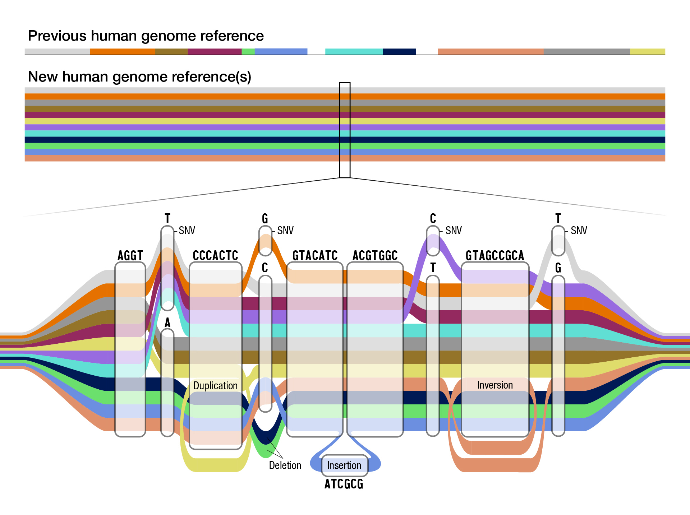
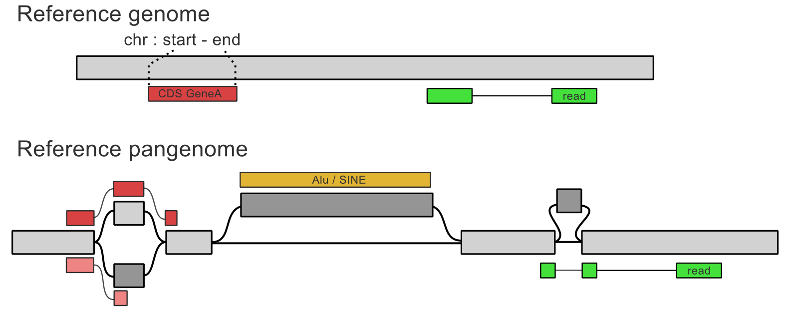
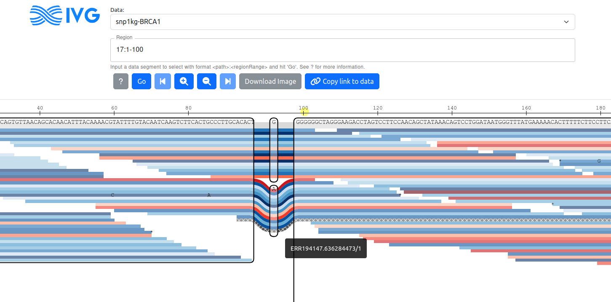
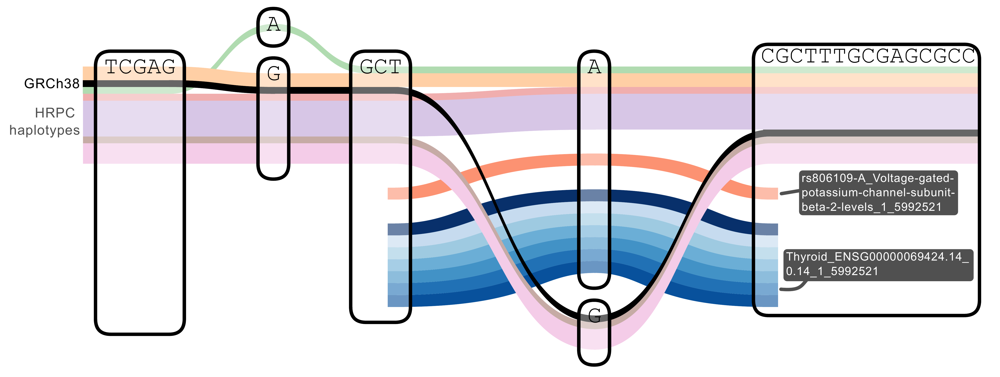
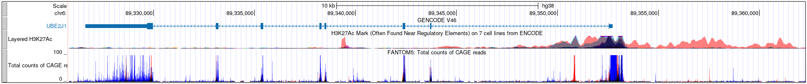
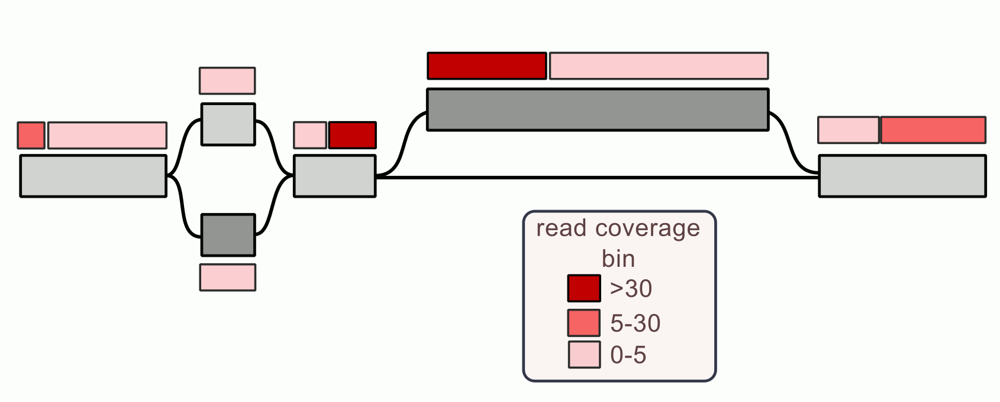
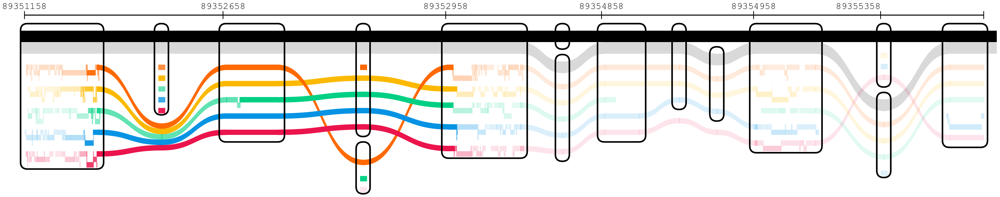
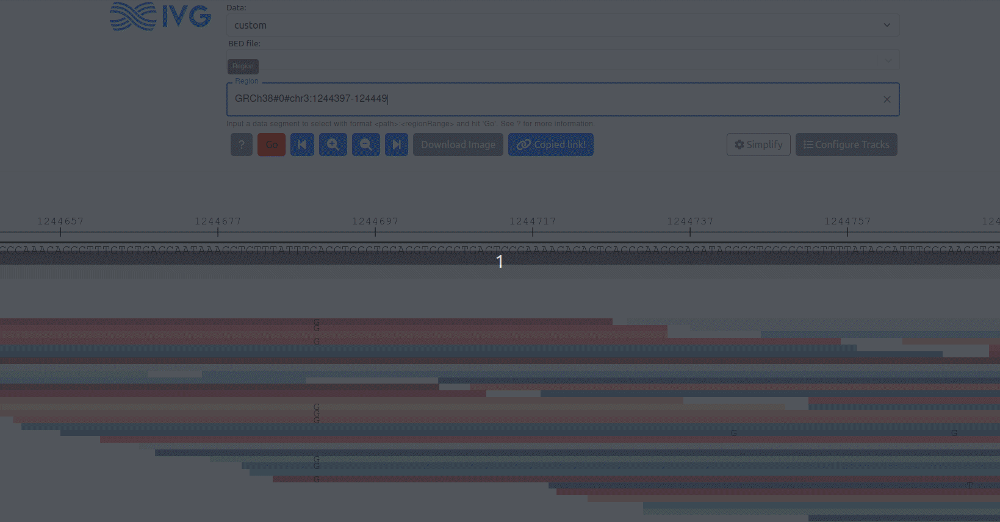
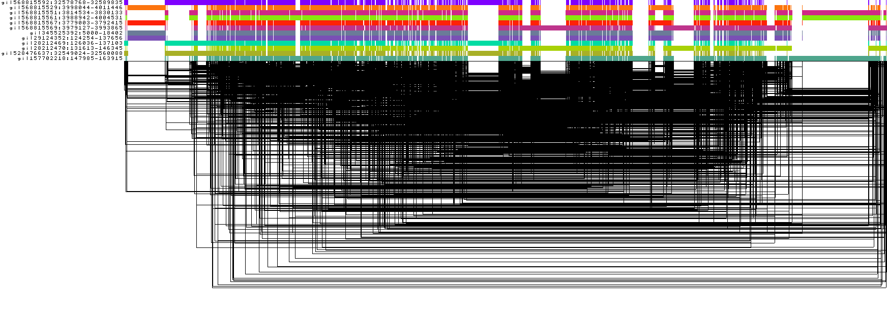

## Pangenome graph from assemblies

Built by aligning high-quality genomes, saved as paths through the pangenome.

{.himg .simg}

Human Pangenome Reference Consortium (HPRC)

<div class="cite">
Liao, Asri, Ebler, et al. Nature 2023
</div>

## Annotations could be paths through the pangenome



. . .

How to **represent** those paths and **index** them efficiently?

. . .

*(doing a minimum amount of work)*

## GAM format

<!-- ## Introduction -->
<!-- https://github.com/rstudio/revealjs -->

- Reads aligned to a pangenome graph.
- Used by `vg`, `GraphAligner`, ...
- Binary/protobuf format, indexable but unwieldy.

. . .

```js
{
    "mapping_quality": 60,
    "name": ">44878920>44878957",
    "path": {
        "mapping": [
            {"edit": [{"from_length": 1, "to_length": 1}],
             "position": {"node_id": "44878920"}, "rank": "1"},
            {"edit": [{"from_length": 1, "to_length": 1}],
             "position": {"node_id": "44878957"}, "rank": "2"}
        ]
    },
    "score": 2,
    "sequence": "AC"
}
```

<div class="legend">
\**json* representation
</div>

## Graph Alignment Format (GAF)

- **Text** format describes mapping between sequences and a graph.

```{.smcode}
read_name_6	100	0	100	+	<394<393<392<391	128	25	124	100	100	60 cs:Z::100
```

. . .

```{.smcode}
!-----query info----------!-----target info----------------!--------------------!
  name size range strand         path size range              align + opt. tags
```

- First, **query** information: name, size, aligned range.
- Then, **target** information: **path**, size, aligned range.
- Finally, additional information: MAPQ, CIGAR, ...

## Indexing genomic files with HTSlib

https://github.com/samtools/htslib

::: incremental

- Index text format on the genomic coordinates, e.g. `chr:start-end`.
    - For example: VCF, BED, SAM/BAM, GFF
- Sorted by `chr`, then `start`, then `end`.
- Compressed with BGZIP (~block gzip).
- Fast extraction of slices.

:::

## Indexing using minimum/maximum node IDs

Assumes node IDs are **sorted** integers.

```
read_name_9	100	0	100	+	<3222<3221<3220<3219	128	18	117	100	100	0
```

::: incremental

- "genomic range": **3219-3222**.
- Same as current strategy for GAM files.
- Modified HTSlib (`bgzip`/`tabix`) to **index based on min/max ID**.
- Modified `vg gamsort` to **sort GAFs based on min/max ID**.

:::

## New commands available

Sorting a GAF file

```sh
vg gamsort -G reads.gaf.gz | bgzip > reads.sorted.gaf.gz
```

Indexing sorted bgzipped GAF

```sh
tabix -p gaf reads.sorted.gaf.gz
```

Extracting a node interval

```sh
tabix reads.sorted.gaf.gz {node}:20034-20158
```

## Sorting short sequencing reads

Illumina 30x short reads for HG002, aligned to the HPRC pangenome with `vg giraffe`.

| Format | Time (H:M:S) | Max. memory used (Kb) | File size (Gb) |
|:------:|-------------:|----------------------:|---------------:|
| GAM    |     11:46:58 |              6,236.60 |            108 |
| GAF    |      6:50:28 |              1,904.83 |             52 |

. . .


**Faster**, less memory, and **smaller files** using GAF.


## Projecting annotation to the pangenome

Input annotation **relative to one haplotype** (BED or GFF), present in the pangenome (path)

```sh
vg annotate -x pg.gbz -f genes.hapH.gff -F > genes.hapH.gaf
```

. . .

*Application* 

Projected the HPRC v1 assemblies' annotations:

- ~4M **gene annotations** in ~16 mins
- ~5.5M **repeats** from RepeatMasker in ~9 mins

## Visualization with the sequenteTubemap

Interactively query a subgraph and aligned reads. 

{.simg .h2img}

Recently modified to accept indexed GAF files.

[https://github.com/vgteam/sequenceTubemap](https://github.com/vgteam/sequenceTubemap)

## Coding sequence (CDS) for two haplotypes in the HPRC pangenome.


<div class="legend">
Haplotypes: CHM13 (*purple*), HG00621 (*greys*). Annotated CDS for HG00621 hap 1 (*reds*) and 2 (*blues*).
</div>

## Visualization with Bandage?

BandageNG can color nodes by paths, **present in the input graph** (GFA).

https://github.com/asl/BandageNG

::: incremental

1. Optional: **extract subgraph** for the region of interest.
    - `vg chunk` or `odgi extract`
2. Add the external annotation as **paths in the graph file**.
    - `vg augment -BF subgraph.pg annot.gaf.gz`
    - `vg convert -f augmented.pg > augmented.gfa`
3. Open with BandageNG, search path by name, **color nodes**.

:::

## Mobile element insertion


<div class="legend">
Node color: *blue* for the reference path, *orange* for the AluYa5 transposon.
</div>

## Projecting variants to the pangenome

Custom scripts to (try to) **find and annotate known variants** in the pangenome.

. . .

*Application*

- **GWAS** hits and **eQTLs** from GTEx
    - ~500Mb bgzipped GAF file for ~75M variants
- **Genotype** calls from short reads.

## Annotating the GWAS catalog and eQTLs



<div class="legend">
*black*: Reference path (GRCh38), *pale colors*: other human haplotypes, *reds*: GWAS catalog, *blues*: eQTLs across tissues (GTEx)
</div>

## Annotating genotype calls

E.g. to investigate supporting reads.


<div class="legend">
*yellow*/*green*: annotation paths from `vg call` genotypes.
*reds*/*blues*: short sequencing reads
</div>

## Summarizing read coverage

E.g. for epigenomics tracks.

On the linear genome:



## Summarizing read coverage

- Re-analyzing ENCODE ATAC-seq data across a few tissues.
- Implemented a naive approach to **bin read coverage**.
    1. Split the coverage in bins, e.g. (0, 5, 30, +)
    2. Extend them to create paths of contiguous bins.

. . .



## Coverage of ATAC-seq data from ENCODE

Reads from 7 cell types aligned with `vg giraffe` to the HPRC pangenome.



<div class="legend">
Compressed view (no sequence shown, node size not to scale).

Reference paths CHM13/GRCh38 (*black*/*grey*) and ATAC-seq coverage track for different tissues (*colors*).
Opacity represents coverage level.
</div>

## Conclusion

**GAF** files can now be sorted/indexed, and then **queried fast**.

. . .

*Limitations*

::: incremental

- Indexing relies on **integer compact node IDs**
    - Output of *Minigraph-Cactus*/*PGGB*, otherwise convert with *vg*/*odgi*
- Designed for **short paths**
- Ugly **metadata handling**: all in a *name*
- Requires **annotations of the input genomes**
- In general, we need **more efficient** visualization tools

:::

## Acknowledgments

Adam M. Novak, Dickson Chung, Glenn Hickey, Sarah Djebali, Toshiyuki T. Yokoyama, Erik Garrison, Benedict Paten.

. . .

Manuscript in preparation + analysis + talk:

https://github.com/jmonlong/manu-vggafannot

**Questions?**

{.simg .himg}

## Compact sorted node IDs through graph sorting

*Graph sorting aims to find the best node order for a 1D and 2D layout.*

{.simg}

<div class="legend">
https://odgi.readthedocs.io/en/latest/rst/tutorials/sort_layout.html
</div>
